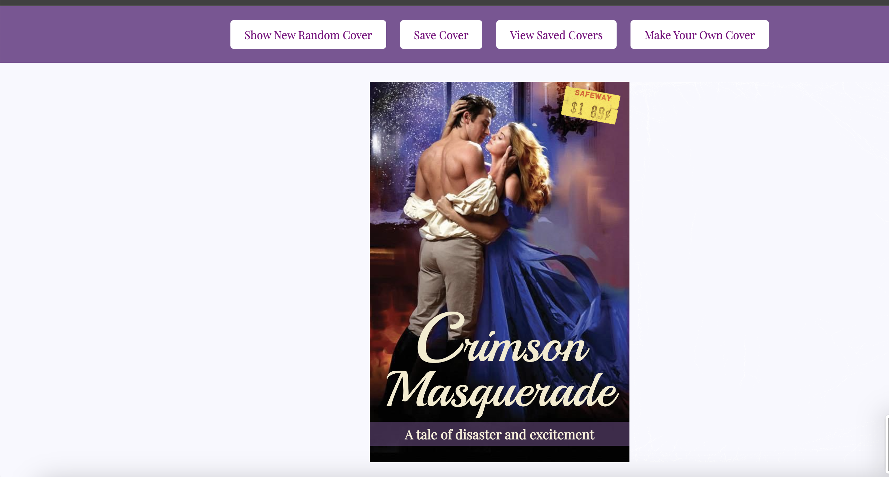

# RomCom
## Abstract: 
An HTML/CSS/JavaScript that displays a random romance cover. Users can also make their own cover.
## Installation Instructions: 
  1. Clone this repo from GitHub
  2. Once the app has been cloned down locally, run open index.html in your Terminal application.
## Preview of App:
   
## Context: 
   This app was made as our first paired project for Turing School of Software Design - Mod 1.
## Contributors:
   - Nicole Rue
   - Ben Rosner
   - Johann Dee
## Learning Goals:
  1. Write clean, DRY JavaScript
  2. Build out functionality using functions that show trends toward SRP 
  3. Manipulate the page after it has loaded adding, removing, and updating elements on the DOM
  4. xplore the connection between HTML, CSS, and JavaScript
  5. Practice reading, understanding, and using provided code
  6. Write code collaboratively
  7. Document changes with atomic commits & thorough code reviews
  8. Communicate, troubleshoot, and plan effectively as a team
  9. Ensure all team members are able to be heard and contribute throughout the project
## Wins + Challenges:
  - Win: Working as a cohesive team.
  - Challenge: Figuring out the event.currentTarget() property
  - Win: Finishing Iterations 1 - 3 in one day
  - Win: Figuring out the extension for error handling/data validation.
  - Challenge: Figuring out how to fix a bug with CSS properties getting overriden. 